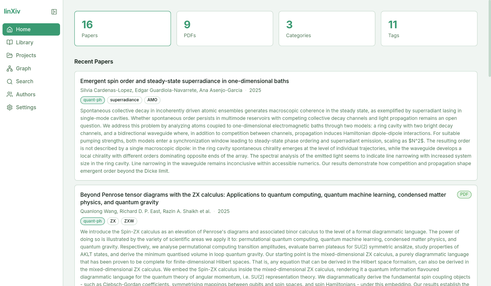
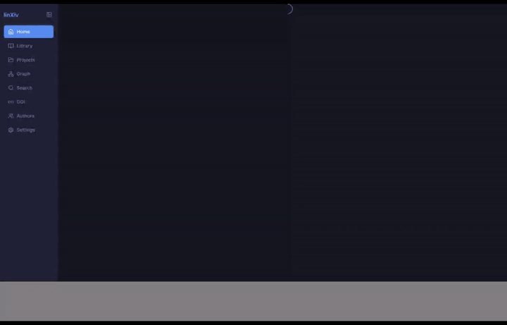

# linXiv

<p align="center">
  <picture>
    <source media="(prefers-color-scheme: dark)" srcset="assets/logo-dark.svg">
    <source media="(prefers-color-scheme: light)" srcset="assets/logo-light.svg">
    
  </picture>
</p>

A local-first desktop application for discovering, managing, and visualizing academic papers from arXiv and other sources. It bundles a native Rust backend (bundled SQLite storage, arXiv/OpenAlex/CrossRef sources, PDF text extraction, BibTeX/Obsidian export) with a React + TypeScript frontend and an interactive paper–author graph, all wrapped in a Tauri v2 desktop shell.

Upload your PDFs, create projects, manage notes, tags, and annotations to organize your library — all locally, without sending your data anywhere. linXiv aims to be a one-stop shop for researchers managing their literature, with the near-term goal of extending to research groups who want to share knowledge without going to the web.

> **Development status:** Pre-1.0 (current version `0.3.0-beta`). The database schema is still evolving, but migration structure is in-place. We are deduping pdfs but working on deduping pdfs, from different sources. 



## Table of Contents

- [Features](#features)
- [Architecture](#architecture)
- [Setup](#setup)
  - [Clone](#clone)
  - [Prerequisites](#prerequisites)
  - [Install dependencies](#install-dependencies)
  - [Run in development](#run-in-development)
- [Building the desktop app](#building-the-desktop-app)
- [CLI](#cli)
- [MCP server](#mcp-server)
- [Graph visualization](#graph-visualization)
- [Data location](#data-location)
- [Acknowledgements](#acknowledgements)

## Features

- **Paper search & fetch** — Search arXiv, OpenAlex, or CrossRef by keyword; fetch by ID; resolve by DOI (arXiv → Semantic Scholar → CrossRef fallback). Results are saved to a local SQLite database with per-paper version tracking.
- **Projects** — Organize papers into projects; scope notes and highlight annotations to a paper within a project; archive, restore, and trash with soft-delete.
- **Notes & PDF annotations** — Attach freeform notes and PDF highlight annotations to papers, optionally scoped to a project.
- **Tags** — Tag papers and projects; list and manage the full tag set.
- **PDF management** — Download PDFs, import local PDFs (with first-page text and metadata extraction via native PDFium), and track total storage usage.
- **Import / export** — Import and export projects as `.lxproj` archives, import BibTeX (`.bib`), and export projects to BibTeX or Obsidian-flavored Markdown.
- **Interactive graph** — Force-directed network of papers and authors (Cytoscape rendering with an fCoSE / D3 layout), with real-time force controls.
- **TeX rendering** — MathJax renders LaTeX math in titles and abstracts, bundled locally for full offline use.
- **CLI & MCP server** — A headless `linxiv` CLI and an `linxiv-mcp` MCP server expose the same library over the terminal and to LLM clients such as Claude.
- **Peer-to-peer project sharing** — Share a project over [iroh](https://www.iroh.computer/) (QUIC + node tickets, no relay server to run) with end-to-end encrypted sync via keyhive + beelay CRDTs; you're the Hoster or a Reader of a share, and a Hoster can invite members as Editor or Viewer; join with a pasted ticket, mirror shared projects into your local library, and sync on your own schedule.



## Architecture

linXiv is a Tauri v2 app. The frontend is React 18 + TypeScript (Vite); the backend is native Rust and runs **in-process** inside the app — the webview calls it through a single `api` Tauri command over IPC, and streams PDFs and graph assets over a custom `linxiv://` scheme. There is no HTTP server and no Python in the packaged app.

The Rust workspace lives under `src-tauri/` (which is also the Cargo workspace root):

```
linXiv/
├── src/                        # React + TypeScript frontend (Vite)
│   ├── api/                    # Typed client — calls the in-process backend via invoke("api")
│   ├── pages/ components/ …    # UI
├── public/graph/               # Force-directed graph viewer (Cytoscape + fCoSE + D3), loaded over linxiv://
├── src-tauri/                  # Tauri shell + Cargo workspace root
│   ├── src/                    # Tauri app: window, api-command router, integrations (install CLI/MCP)
│   │   └── bin/dev_server.rs   # linxiv-dev-server: dev-only HTTP shim over the Rust core (see Run in development)
│   ├── crates/
│   │   ├── core/               # linxiv-core: all library logic (sources, storage, formats, graph, service)
│   │   │   └── src/sources/    #   arXiv, OpenAlex, CrossRef, DOI resolution, PDF metadata, downloads
│   │   ├── cli/                # linxiv-cli → the `linxiv` binary (headless CLI)
│   │   ├── mcp/                # linxiv-mcp → the `linxiv-mcp` binary (MCP stdio server)
│   │   ├── migrate/            # one-off schema migration binary
│   │   ├── p2p/                # linxiv-p2p: vendored iroh transport, keyhive membership/roles, beelay E2EE sync
│   │   └── share/              # shared-project store — service layer over linxiv-p2p (publish/join/sync, encrypted key store)
│   ├── binaries/               # staged CLI + MCP sidecars (target-triple suffixed) for `tauri build`
│   ├── tauri.conf.json         # app config; bundles the linxiv + linxiv-mcp sidecars as externalBin
│   └── Cargo.toml              # workspace manifest
├── scripts/
│   ├── fetch_pdfium.sh         # downloads the native libpdfium used for PDF text extraction
│   └── stage_rust_bins.sh      # builds + stages the CLI/MCP sidecars into src-tauri/binaries/
└── assets/                     # logo, icons, GIFs
```

**Storage.** SQLite is compiled in via `rusqlite` (bundled, FTS5 for full-text search) — no system `libsqlite3` needed. The database is `papers.db` in the per-user app data directory.

**PDF extraction.** First-page text and metadata come from native `libpdfium` (`pdfium-render`). The shared library is fetched by `scripts/fetch_pdfium.sh` and bundled as a Tauri resource.

## Setup

### Clone

This repo has git submodules (`docs/adr`, `src-tauri/crates/p2p`) — a plain `git clone` leaves them empty and the build will fail resolving `linxiv-share`'s dependency on `crates/p2p`.

```bash
git clone --recurse-submodules https://github.com/linxiv-dev/linXiv.git
# already cloned without --recurse-submodules?
git submodule update --init --recursive
```

### Prerequisites

- [Rust toolchain](https://rustup.rs/) (stable) — builds the backend, CLI, MCP server, and Tauri shell
- [Node.js](https://nodejs.org/) 20.16+ (or 22.3+) — frontend / Tauri tooling; `pdfjs-dist` requires at least this
- System Tauri dependencies — follow the [Tauri v2 prerequisites guide](https://tauri.app/start/prerequisites/) for your OS (WebKit2GTK on Linux, Xcode Command Line Tools on macOS, Microsoft C++ Build Tools on Windows)

> The build pulls the `tauri-plugin-texbrain` crate as a git dependency (`github.com/linxiv-dev/tex-brain-linxiv-plugin`, pinned in `Cargo.lock`) — no extra checkout needed.

### Install dependencies

```bash
npm install                       # frontend dependencies
bash scripts/fetch_pdfium.sh      # native libpdfium (PDF import/extraction; also a bundled Tauri resource, see below)
bash scripts/stage_rust_bins.sh   # builds + stages the linxiv/linxiv-mcp sidecars (see below)
```

Rust crates are fetched automatically on first `cargo`/`tauri` build.

> **Both scripts above are required before `cargo check`/`cargo build`/`tauri dev` will even compile — not just for a full `tauri build`.**
> `src-tauri/tauri.conf.json` bundles `linxiv`/`linxiv-mcp` as Tauri sidecars (`bundle.externalBin`) and `vendor/pdfium/lib/` as a resource, and `tauri-build`'s build script validates all of these paths *at compile time*. They're gitignored, so on a fresh checkout `cargo check --workspace` fails first with `resource path "binaries/linxiv-<triple>" doesn't exist`, then (once the sidecars are staged) with `resource path "vendor/pdfium/lib" doesn't exist`. `fetch_pdfium.sh` downloads libpdfium into `src-tauri/vendor/pdfium/`; `stage_rust_bins.sh` runs `cargo build --release -p linxiv-cli -p linxiv-mcp` and copies the binaries into `src-tauri/binaries/` with the host target-triple suffix (`npm run build:sidecar` runs both). Re-run `stage_rust_bins.sh` whenever `linxiv-cli`/`linxiv-mcp` source changes and you need the sidecars to reflect it.

### Run in development

Native desktop window (recommended — runs the in-process Rust backend, hot-reloads the frontend):

```bash
npm run tauri dev
```

Browser-only dev loop (no native window; uses a dev-only HTTP shim that serves the backend over `/api`):

```bash
# terminal 1 — dev backend (linxiv-dev-server, HTTP shim over the Rust core)
npm run dev:api

# terminal 2 — Vite dev server on :5180 (proxies /api to the shim)
npm run dev
```

## Building the desktop app

The `linxiv` (CLI) and `linxiv-mcp` (MCP server) binaries ship inside the app as Tauri sidecars.

```bash
npm run build:sidecar   # fetch libpdfium + build/stage the CLI & MCP sidecars into src-tauri/binaries/
npm run tauri build     # build the app and bundle it
```

Or run both in one step:

```bash
npm run build:all
```

The installer/bundle is written to `src-tauri/target/release/bundle/`.

After installing the app, open **Settings** to:
- **Install CLI** — symlinks the bundled `linxiv` binary to `~/.local/bin/linxiv` (Linux/macOS) or writes a PATH shim on Windows.
- **Integrations** — register the bundled MCP server with a detected client (Claude Desktop, Claude Code, and others) by writing its config file.

## CLI

The `linxiv` binary is a headless interface to the same library the app uses. In a checkout you can run it without installing:

```bash
# from src-tauri/
cargo run -p linxiv-cli -- --help
```

Installed (via the app's **Install CLI**, or a staged/bundled build), invoke it directly as `linxiv`. All commands print JSON to stdout; pass `--help` to any command or subcommand for full options.

```bash
linxiv --version

# Search (source: arxiv (default), openalex, or crossref)
linxiv search "attention is all you need" --max 5
linxiv search "diffusion models" --source openalex --max 10
linxiv search "lattice QCD" --source crossref --max 3

# Fetch and save a paper by ID
linxiv fetch 2204.12985
linxiv fetch W3123456789 --source openalex

# List stored papers
linxiv list --limit 20 --offset 0 --category cs.LG

# Papers
linxiv paper get 2204.12985
linxiv paper versions 2204.12985
linxiv paper search "scaled dot-product"     # full-text search of the local library
linxiv paper delete 2204.12985               # soft-delete
linxiv paper restore 2204.12985
linxiv paper hard-delete 2204.12985
linxiv paper remove-from-all-projects 2204.12985

# Tags (on papers)
linxiv tag add 2204.12985 transformers attention deep-learning
linxiv tag remove 2204.12985 attention
linxiv tag list 2204.12985
linxiv tag list-all
linxiv tag create my-tag
linxiv tag delete 42
# Tags (on projects)
linxiv tag add-project 1 reading-list
linxiv tag remove-project 1 reading-list
linxiv tag list-project 1

# Projects
linxiv project list
linxiv project list --status active                # active | archived | deleted
linxiv project get 1
linxiv project create "Diffusion Models" --description "Score-based generative models" --color "#4f86f7" --tags generative
linxiv project update 1 --name "Diffusion Models v2" --status archived
linxiv project add-paper 1 2006.11239
linxiv project remove-paper 1 2006.11239
linxiv project archive 1
linxiv project restore 1
linxiv project delete 1                            # soft-delete
linxiv project hard-delete 1
linxiv project export 1 ./diffusion --pdfs         # .lxproj archive
linxiv project import ./diffusion.lxproj --on-conflict merge   # merge | overwrite; --preview for a dry run
linxiv project export-bibtex 1 ./diffusion.bib
linxiv project export-obsidian 1 ./diffusion.md

# Notes
linxiv note create 2204.12985 "Key insight: scaled dot-product attention" --title "Reading notes"
linxiv note create 2204.12985 "Follow-up question" --project-id 1
linxiv note get 7
linxiv note list --paper-id 2204.12985
linxiv note list --project-id 1
linxiv note update 7 --content "Revised note"
linxiv note delete 7

# PDF highlight annotations
linxiv annotation create 2204.12985 '<anchor-json>' --comment "important" --project-id 1
linxiv annotation list --paper-id 2204.12985
linxiv annotation get 3
linxiv annotation update 3 --comment "revised"
linxiv annotation delete 3

# PDFs
linxiv pdf path 2204.12985
linxiv pdf path 2204.12985 --version 2
linxiv pdf download 2204.12985 https://arxiv.org/pdf/2204.12985
linxiv pdf import ./local-paper.pdf --project-id 1
linxiv pdf storage

# DOI
linxiv doi resolve 10.48550/arXiv.1706.03762     # resolve to metadata, no save
linxiv doi save 10.48550/arXiv.1706.03762        # resolve and save to library

# Authors
linxiv author list
linxiv author get 12
linxiv author update 12 --full-name "A. N. Other"
linxiv author delete 12                          # blocked if still linked to papers

# BibTeX import
linxiv bibtex import ./refs.bib

# Trash (soft-deleted items)
linxiv trash list
linxiv trash restore 2204.12985
linxiv trash hard-delete 2204.12985
linxiv trash restore-project 1
linxiv trash hard-delete-project 1

# Library / maintenance
linxiv stats
linxiv categories
linxiv settings get
linxiv settings update <key> <value>             # value is JSON-parsed if valid JSON, else a string
linxiv backup ./papers.bak                       # snapshot the DB
linxiv restore ./papers.bak                      # restore even if the live DB is broken
```

## MCP server

`linxiv-mcp` is a stdio MCP server exposing ~60 tools (search, fetch, papers, projects, tags, notes, annotations, PDFs, trash, authors, import/export, settings, stats) so an MCP client like Claude can drive your library directly.

The simplest path is to install the desktop app and use **Settings → Integrations**, which registers the bundled server with a detected client.

To register manually with the Claude Code CLI, point it at the built or bundled binary:

```bash
claude mcp add linxiv -- /path/to/linxiv-mcp
```

Or add it to a client's MCP config (e.g. `claude_desktop_config.json`):

```json
{
  "mcpServers": {
    "linxiv": {
      "command": "/path/to/linxiv-mcp"
    }
  }
}
```

In a checkout you can run it straight from source with `cargo run -p linxiv-mcp` (from `src-tauri/`).


## Graph visualization

Papers and authors form a force-directed network: papers connect to their authors, laid out with an fCoSE / D3 force simulation and rendered with Cytoscape. The control panel exposes real-time sliders:

| Slider | Effect |
|---|---|
| Center force | Pulls/pushes nodes toward the center |
| Repel force | Controls node-to-node repulsion |
| Link distance | Target edge length |
| Link strength | Stiffness of paper–author edges |

The viewer, MathJax, D3, and the UI font are all bundled locally — no external CDN calls, so the interface works fully offline.

## Data location

The database (`papers.db`), managed PDFs, and the Obsidian vault live in the per-user app data directory for `com.linxiv.app` (e.g. `~/.local/share/com.linxiv.app` on Linux, `~/Library/Application Support/com.linxiv.app` on macOS). Set the `LINXIV_DATA_DIR` environment variable to override the location — the app, CLI, and MCP server all honor it, so they share one library.

## Acknowledgements

Thank you to arXiv for use of its open access interoperability!

linXiv owes a debt to [Qiqqa](https://github.com/jimmejardine/qiqqa-open-source), the open-source research management tool originally created by Jimme Jardine.

PDF text and metadata extraction is currently powered by [PDFium](https://pdfium.googlesource.com/pdfium/) (Google's PDF rendering library) via the [`pdfium-render`](https://github.com/ajrcarey/pdfium-render) Rust bindings.
